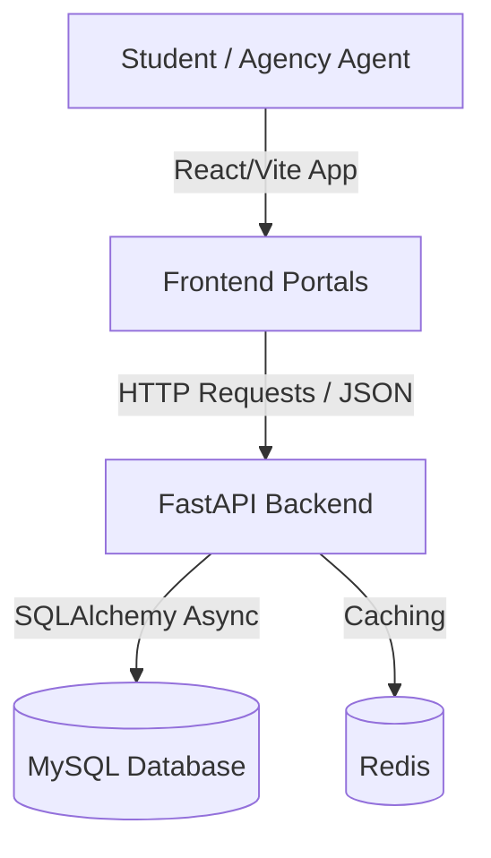

# EduConsultant - Student & Agency Educational Platform

EduConsultant is a production-grade educational guidance and consultancy platform designed to bridge students, agencies, and institutions. This repository contains the complete codebase, organized into a unified monorepo structure.

## Repository Structure

- **[Backend](file:///E:/friends/Noman/ECP-main/Backend)**: Robust FastAPI backend utilizing a MySQL database (SQLAlchemy 2.0 async), Pydantic schemas, Alembic migrations, Redis caching, and Docker.
- **[Frontend](file:///E:/friends/Noman/ECP-main/Frontend)**: Premium React 19 + Vite student and agency portal, styled with Vanilla CSS custom properties, utilizing React Query and client-side routing via React Router DOM.

> [!NOTE]
> The standalone `agency-portal/` folder (the legacy prototype portal UI) is intentionally skipped from the git index and ignored in favor of the integrated, unified student and agency interfaces within the main `Frontend` application.

---

## Quick Start

### 1. Prerequisite Checklist
Ensure you have the following installed:
- Python 3.10+
- Node.js 18+ (with npm)
- MySQL / Redis (if running services locally)

### 2. Setting Up the Backend
For detailed instructions, refer to the [Backend README](file:///E:/friends/Noman/ECP-main/Backend/README.md).
```bash
cd Backend
python -m venv venv
source venv/bin/activate  # On Windows: venv\Scripts\activate
pip install -r requirements.txt
cp .env.example .env      # Configure database credentials in .env
uvicorn main:app --reload
```

### 3. Setting Up the Frontend
For detailed instructions, refer to the [Frontend README](file:///E:/friends/Noman/ECP-main/Frontend/README.md).
```bash
cd Frontend
npm install
npm run dev
```

---

## System Architecture

EduConsultant follows a modular and domain-driven service architecture:



For more documentation on specific domains, please consult the respective directories.
